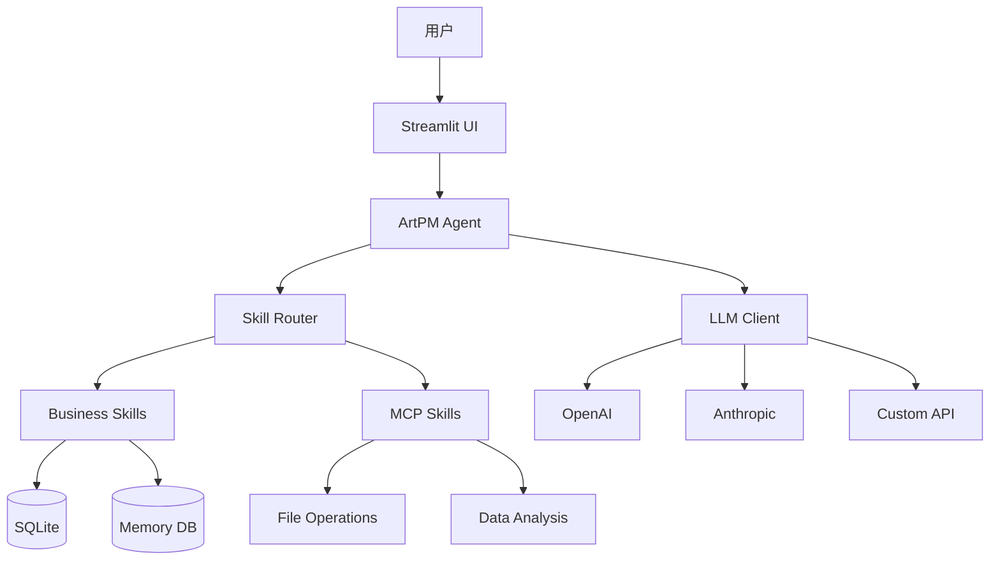
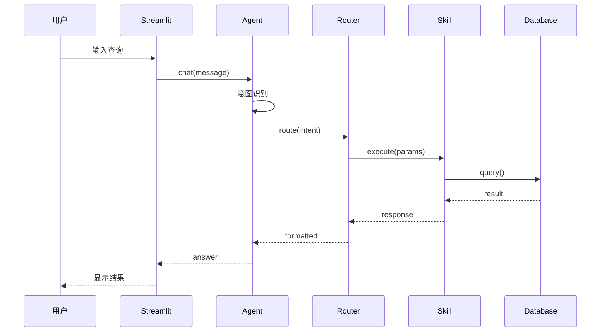
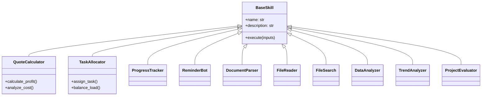
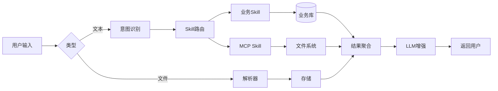

# ArtPM Agent 架构图

## 整体架构

```mermaid
graph TB
    User[用户] --> UI[Streamlit UI]
    UI --> Agent[ArtPM Agent]
    
    Agent --> Router[Skill Router]
    Router --> Skills[Business Skills]
    Router --> MCP[MCP Skills]
    
    Skills --> DB[(SQLite)]
    Skills --> Memory[(Memory DB)]
    
    MCP --> Files[File Operations]
    MCP --> Analysis[Data Analysis]
    
    Agent --> LLM[LLM Client]
    LLM --> OpenAI[OpenAI]
    LLM --> Anthropic[Anthropic]
    LLM --> Custom[Custom API]
```

## 请求流程

```mermaid
sequenceDiagram
    participant U as 用户
    participant UI as Streamlit
    participant A as Agent
    participant R as Router
    participant S as Skill
    participant DB as Database
    
    U->>UI: 输入查询
    UI->>A: chat(message)
    A->>A: 意图识别
    A->>R: route(intent)
    R->>S: execute(params)
    S->>DB: query()
    DB-->>S: result
    S-->>R: response
    R-->>A: formatted
    A-->>UI: answer
    UI-->>U: 显示结果
```

## 技能架构

```mermaid
classDiagram
    BaseSkill <|-- QuoteCalculator
    BaseSkill <|-- TaskAllocator
    BaseSkill <|-- ProgressTracker
    BaseSkill <|-- ReminderBot
    BaseSkill <|-- DocumentParser
    BaseSkill <|-- FileReader
    BaseSkill <|-- FileSearch
    BaseSkill <|-- DataAnalyzer
    BaseSkill <|-- TrendAnalyzer
    BaseSkill <|-- ProjectEvaluator
    
    class BaseSkill {
        +name: str
        +description: str
        +execute(inputs)
    }
    
    class QuoteCalculator {
        +calculate_profit()
        +analyze_cost()
    }
    
    class TaskAllocator {
        +assign_task()
        +balance_load()
    }
```

## 数据流

```mermaid
graph LR
    A[用户输入] --> B{类型}
    B -->|文本| C[意图识别]
    B -->|文件| D[解析器]
    
    C --> E[Skill路由]
    D --> F[存储]
    
    E --> G[业务Skill]
    E --> H[MCP Skill]
    
    G --> I[(业务库)]
    H --> J[文件系统]
    
    I --> K[结果聚合]
    J --> K
    F --> K
    
    K --> L[LLM增强]
    L --> M[返回用户]
```
